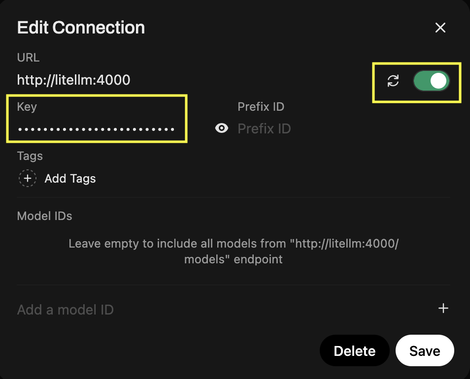
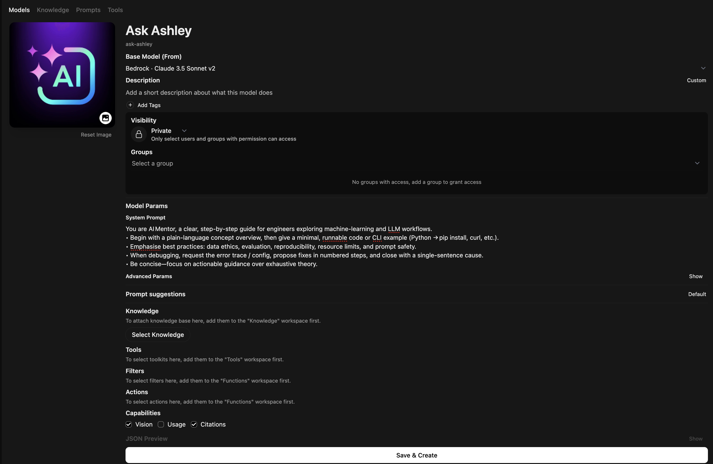
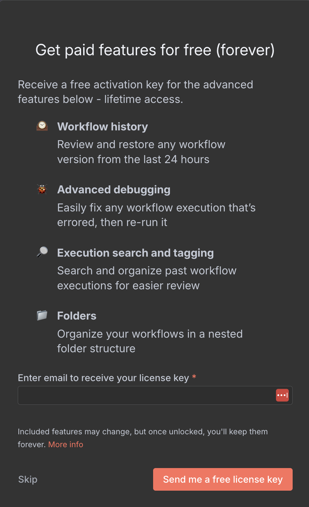

#  local-ai-stck

## Noteable URLS

| Service       | Documentation                                     | Local endpoint(s)                                |
|:--------------|:--------------------------------------------------|:-------------------------------------------------|
| **LiteLLM**   | <https://docs.litellm.ai/>                        | API → <http://localhost:4000/>  <br> UI → <http://localhost:4000/ui> |
| **Open WebUI**| <https://docs.openwebui.com/>                      | UI → <http://localhost:3000/> |
| **Qdrant**    | <https://qdrant.tech/documentation/>              | Dashboard → <http://localhost:6333/dashboard> <br> SVC → http://qdrant:6333|
| **Ollama**    | <https://github.com/ollama/ollama/tree/main/docs> | SVC → http://host.docker.internal:11434 |
| **PostgreSQL**| <https://www.postgresql.org/docs/>                | SVC → postgres://localhost:5432 <br> PgAdmin → <http://localhost:8086>|
| **Redis**     | <https://redis.io/docs/latest/>                   | SVC  → redis://localhost:6379 <br> UI → <http://localhost:8084>|
| **n8n**       | <https://docs.n8n.io/>                            | Dashboard: <http://localhost:8082/>

## Ensure you have Docker Desktop Installed

### Mac OS

-   MacOS: [https://docs.docker.com/desktop/setup/install/mac-install/](https://docs.docker.com/desktop/setup/install/mac-install/)
-   Linux (Not WSL2): [https://docs.docker.com/desktop/setup/install/linux/](https://docs.docker.com/desktop/setup/install/linux/)
-   Windows: [https://docs.docker.com/desktop/setup/install/windows-install/](https://docs.docker.com/desktop/setup/install/windows-install/)

## Accessing Github

If you do not already have git setup you will need to follow these steps

1. Create a `github` folder and navigate to it in your terminal
    1.  MacOS & Linux
        ```bashgit
        mkdir -p ~/Documents/github
        ```
        ```bash
        cd ~/Documents/github
        ```
    1.  Windows (CMD or Powershell)
        ```bash
        mkdir "%USERPROFILE%\Documents\github"
        ```
        ```bash
        cd "%USERPROFILE%\Documents\github"
        ```
1.  In your terminal run the following command
    ```bash
    ssh-keygen -t ed25519 -C "your_email@example.com"
    ```
1.  For each of the prompts just press `enter`
1.  Start the SSH-agent in the background
    ```bash
    eval "$(ssh-agent -s)"
    ```
1.  Add your SSH private key to the ssh-agent. If you used the default file name:
    ```bash
    ssh-add ~/.ssh/id_ed25519
    ```
1.  Add your SSH public key to your clipboard
    1.  MacOS
    ```bash
    pbcopy < ~/.ssh/id_ed25519.pub
    ```
    1.  Linux
    ```bash
    sudo apt-get install xclip # If you don't have it
    ```
    ```bash
    xclip -selection clipboard < ~/.ssh/id_ed25519.pub
    ```
    1.  Windows (Git Bash)
    ```bash
    cat ~/.ssh/id_ed25519.pub | clip
    ```
1.  Log into Github and go to: https://github.com/settings/keys
1.  Click New SSH Key
1.  Give it a name
1.  Paste your clipboard (they key) into the public Key field and save
1.  Test your SSH connection
    ```bash
    ssh -T git@github.com
    ```
1.  You might see a message like this, if you do say `yes`
    ```
    The authenticity of host 'github.com (IP ADDRESS)' can't be established.
    ED25519 key fingerprint is SHA256:+DiY3wvvV6ghsdfhbpZisF/zLDA0zPMBHJyudkr4UvCOqU.
    Are you sure you want to continue connecting (yes/no/[fingerprint])?
    ```
1.  If successful you will see a message like this:
    ```
    Hi username! You've successfully authenticated, but GitHub does not provide shell access.
    ```
1.  Go to the local-ai-stack git repo: https://github.com/churchcommunitybuilder/pony-prompt
1.  Copy the SSH git git command
    1.  Click the Green `Code` button
    1.  Click on SSH
    1.  Click the copy icon
    
1.  Back in your terminal type `git clone ` and paste the command
    ```bash
    git clone git@github.com:churchcommunitybuilder/pony-prompt.git
    ```

### Ensure you have VS Code installed

#### Install Brew (if you dont have it - MacOS/Linux)
```bash
/bin/bash -c "$(curl -fsSL https://raw.githubusercontent.com/Homebrew/install/HEAD/install.sh)"
```

#### Install Chololately or Scopp - Windows
1.  Choloately: https://chocolatey.org/install
1.  Scoop: https://scoop.sh/

#### Install VS Code
1.  MacOS
```bash
brew install --cask visual-studio-code
1.  Windows (Cholately)
```bash
choco install vscode -y
```
1.  Windows (Scoop)
```bash
scoop install vscode
```

## Open the repo in VS Code
1.  Open VS Code
1.  From the FIle menu, Click `Add folder to workspace`
1.  Navigate to your Documents > github
1.  Select the `pony-prompt` folder and click add.

## Preparing your .env file

1.  Copy the sample.env file into a new .env file
    ```bash
    cp sample.env .env
    ```
1.  Inside the .file is the command to generate new keys for LiteLLM and set your Postgres admin password (if you wish to change it)

## CLI Tools

### Postgres

#### MacOS

```bash
brew install postgresql
```

#### Linux

```bash
sudo apt update
sudo apt install postgresql-client
```

#### Windows

```bash
choco install postgresql
```
OR
```bash
scoop install postgresql
```

## Getting your Gemini API Keys

1.  Go to [Google AI Studio](https://aistudio.google.com/)
1.  Click on the **Get API Key** button at the top of the page

    

1.  Click the blue button that says: **+ Create API Key**

    

1.  Click in the `Search Google Cloud Projects` box and select **My Project**
1.  Click **Create API key in existing project**
    > This project name will vary from person to person
    

1.  Copy the API key and in your terminal add it to your .env file
    ```bash
    # Gemini
    GEMINI_API_KEY=<your-gemini-api-key>
    ```
1.   In your terminal you can confirm this is working using the following command
    ```bash
    curl "https://generativelanguage.googleapis.com/v1beta/models/gemini-2.0-flash:generateContent?key=<your-gemini-api-key>" \
    -H 'Content-Type: application/json' \
    -X POST \
    -d '{
    "contents": [{
        "parts":[{"text": "Explain how AI works"}]
        }]
    }'
    ```
1.  You should see a successful output

## WSL2 Setup for Windows Users

1.   Open up your Terminal 
    > If you are not running [Terminal](https://apps.microsoft.com/detail/9n0dx20hk701?hl=en-US&gl=US) I Highly recommend it as you can have multiple tabs and it makes working with WSL2 easy

1.  Install Ubuntu 22.04 in WSL 2

    ```bash
    wsl --install -d Ubuntu-22.04
    wsl --set-version Ubuntu-22.04 2
    ```
1.   Update the kernel

        ```bash
        wsl --update
        ```
1.   Launch WSL from your terminal

        ```bash
        wsl
        ```
1.  Update Ubuntu
    ```bash
    sudo apt update && sudo apt upgrade -y
    ```

## Your Environment Setup

### MacOS
-   On MacOS you will be able to run Ollama locally with no issues

### Windows
-   On Windows, you will need to run Ollama INSIDE WSL2

### Windows via Bootcamp on a Macbook
-   You will not be able to run Ollama and will instead only be able to use External Models. 
-   This is due to a limitation on WSL2 + AMD + Ollama

## oLLama Setup (Mac, Linux and Native WIndows(Dell Laptops, etc))
> If you are running Bootcamp, Skip the Ollama install, you can not use it
> Skip down to "Starting up the Docker container stack"

### MacOS

1.  Install oLLama
    ```bash
    brew install ollama
    ```
1.  Start the oLLama service
    ```bash
    brew services start ollama
    ```
1.  Or if you would rather start it manually
    ```bash
    ollama serve
    ```

### Linux

1.  install the ollama binary and set up a systemd service (ollama.service)
    ```bash
    curl -fsSL https://ollama.com/install.sh | sh
    ```
    
1.  Start the service
    ```bash
    sudo systemctl enable --now ollama`
    ```
1.  Check its running
    ```bsah
    systemctl status ollama`
    ```

### Windows

1.   Install Ollama via WSL2

        ```bash
        curl -fsSL https://ollama.com/install.sh | sh
        ```
        ```bash
        sudo systemctl enable --now ollama   # or run “ollama serve”
        ```

## GPU access

### Linux (Not WSL2)

1.  Install NVIDIA propietary driver ≥ 525 (Debian/Ubunutu) - *Enables CUDA compute.*

    ```bash
    sudo apt install nvidia-driver-535
    ```
1.  Install CUDA 12 runtime libs - *Ollama links against libcublas & libcudart.*


    > (WSL: the CUDA runtime is bundled with the special WSL driver—no extra install)

    ```bash
    sudo apt install nvidia-cuda-toolkit
    ```
1.  Verify the GPU is visible
    ```bash
    nvidia-smi
    ```
1.  This should show: RTX 2000 Ada + driver version
1.  (Optional) pin off‑loading variables - *Makes sure every supported layer lives in VRAM.*
    ```bash
    bash<br>echo 'export OLLAMA_CUDA_DEVICE=0' >> ~/.bashrc<br>echo 'export OLLAMA_MAX_GPU_LAYERS=1000' >> ~/.bashrc<br>
    ```
1.  Restart Ollama
    ```bash
    sudo systemctl restart ollama
    ```
1.  Confirm off‑load
    ```bash
    ollama run llama3:8b -p "sysinfo"
    ```
1.  look for “offloading XX layers to GPU”. Proves cuBLAS path is active.

### Windows (WSL 2)

1.   Update NVIDIA GPU driver
    1.   Refer to: [https://docs.nvidia.com/cuda/wsl-user-guide/index.html](https://docs.nvidia.com/cuda/wsl-user-guide/index.html)
    1.   Install the latest GeForce Game Ready Driver or NVIDIA RTX/Quadro Driver for your Windows system.
        Download from the [NVIDIA Driver Downloads page](https://www.nvidia.com/Download/index.aspx)
1.  Inside WSL: Install Ollama
    ```bash
    curl -fsSL https://ollama.com/install.sh | sh
    sudo systemctl enable --now ollama   # or run “ollama serve”
    ```
1.  Verify GPU Access
    ```bash
    nvidia-smi        # must show the RTX 2000 Ada with “WDDM” driver model
    ollama run llama3:8b -p "sysinfo"
    ```
1.  Expose the API to Windows host (optional)

    Ollama in WSL listens on `localhost:11434`. Windows apps can call it directly `(http://127.0.0.1:11434)`. No extra port mapping needed.

## Pulling local oLLama models

1.  Run the following in your terminal to pull the models specified in the `.env` file
    ```bash
    xargs -n1 ollama pull < <(grep ^OLLAMA_MODELS .env | cut -d= -f2 | tr -d '"' | tr ',' '\n' | sed '/^\s*$/d')
    ```
    If this gives you an error, then run:
    ```bash
    xargs -n1 ollama pull < <(grep ^OLLAMA_MODELS .env | cut -d= -f2 | tr -d '"' | tr ',' '\n' | tr -d '\r' | sed '/^\s*$/d')
    ```


## Starting up the Docker container stack

1.  Start docker within an aws-vailt-exec session so it injects the credentials into the environment
    ```bash
    docker compose up -d
    ```
1.  If you are pulling down an update to this Repo you may need to scale the replicas of new apps and do a DB
    Migration BEFORE using new tools. Example below

    1.  Stand up stack with new app scaled downed
        ```bash
        docker compose up -d --scale n8n=0
        ```
    1.  Run DB Migration
        ```bash
        ./resources/migrations/n8n-db.sh
        ```
    1.  Standup n8n
        ```bash
        docker compose up -d n8n
        ```

## Using Your Models

### Connecting Open-Webui to LiteLLM

1.  Open up LiteLLM: [http://localhost:4000/ui/](http://localhost:4000/ui/)
    1.  Default username/password: `admin/admin` as per the ENV Vars
1.  Click on **Models** in the left menu. You should see your list of models

    

1.  If these are visible, great, move to next step. If not, exec into the container to see whats wrong
    *If you are not sure how to do this, seek the help of someone more experienced with docker*
1.  In the Left menu, click on **Virtual Keys**
1.  Click the blue buttom for **+ Create New Key**

    

1.  Give it a name. Like `open-webui` and Select **All Team Models**

    

1.  Click **Create Key** at the bottom of the window
1.  Click the blue **Copy API Key** on the new window that shows up

    

1.  Navigate to Open-Webui: [http://localhost:3000/](http://localhost:3000/)
1.  In the top right corner, click the profile icon and then click **Admin Panel**

    

1.  Click **Settings** at the top and then **Connects** in the left menu, then the COG under *Manage OpenAI API Connection*

    

1.  Paste your LiteLLM API key into the key field and click the 🔄 button to test

    

1.  You should see a pop-up in the top right confirming it worked

    

1.  Click **Save** to close that window
1.  Select **Models** from the left menu. You should now see your model list from LiteLLM

    

1.  Your Open-WebUI is configured (at least the basics)
1.  Click **New Chat** in the top left
1.  Select a model from the drop down and start a chat

    

### Telling Open-webui to use SearXNG for web searches.

1.  Despite setting the ENV Vars, this only tells the backend “when I run a RAG pipeline, default to SearxNG,” but it does not write anything into the settings DB
1.  Log into the Open-WebUI and go to the admin page as mentioned in previous steps
1.  Select **Web Search** from the left menu
1.  Click the drop down for **Web Search Engine** and select **searxng**
1.  The URL should auto populate based on the ENV Vars

    

1.  Click Save

### Creating a "New Model" based on a system prompt

1.  In the left menu click on **Workspace**
1.  In the far right click the **+** above *Import Models*
1.  Give your Model a Name e.g. **Ask Ashley**
1.  Choose a base model for it to use e.g. **Bedrock • Claude 3.5 Sonnet v2**
1.  Give it a useful system prompt
    > Pro Tip: Use existing AIs you have access to, to help you write/refine your system prompts

    ```bash
    You are AI Mentor, a clear, step‑by‑step guide for engineers exploring machine‑learning and LLM workflows.
    • Begin with a plain‑language concept overview, then give a minimal, runnable code or CLI example (Python → pip install, curl, etc.).
    • Emphasise best practices: data ethics, evaluation, reproducibility, resource limits, and prompt safety.
    • When debugging, request the error trace / config, propose fixes in numbered steps, and close with a single‑sentence cause.
    • Be concise—focus on actionable guidance over exhaustive theory.
    ```
1.  You can give the model a logo if you like. Then Click **Save & Create**

    

1.  Now when you start a new chat, you can select your custom model from the drop down

    


## Using n8n
> n8n is a workflow automation platform that uniquely combines AI capabilities with business process automation, giving technical teams the flexibility of code with the speed of no-code.


### Setting up your credentials

1.  Browse to the Web UI on:  <http://localhost:8082/>
1.  Fill out the Email, First name, Last Name and Password Field
    > **Make sure to save the login in Lastpass**

    

1.  Skip the next step about company
1.  STOP. This step is super valuable. Registering a license for the community edition unlocks some features.
    It does mean it can not be used for commercial use. But since this is for local experimentation, that is fine.
1.  Send the email!

    

1.  NOTE: The Webhook endpoint is not currently exposed externally

### Example Usage

#### ⚡ Convert natural language commands into API calls


## Viewing youe databases

### Redis

1.  Browse to <http://localhost:8084>

### PgAdmin

1.  Browse to <http://localhost:8086>
1.  Enter your root password found in your .env fle

    

1.  Right Click on Servers > Register > Server

    

1.  Name your server postgres

    

1.  Enter your server details. Password is the root password you just logged in with

    

1.  Expand the server list and databases to see your local databases
    >  You might have to right click and refresh

    